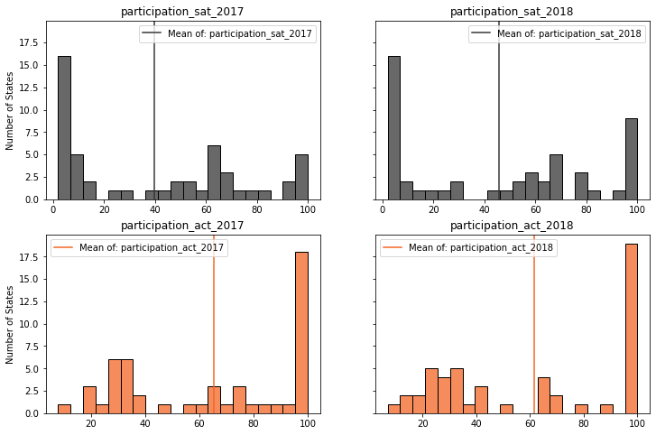
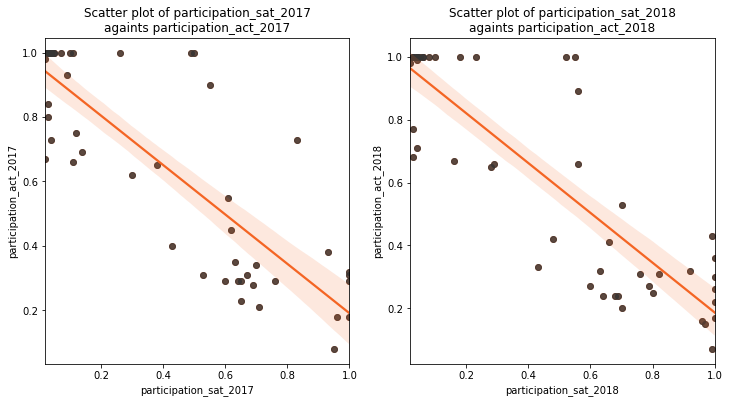
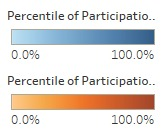
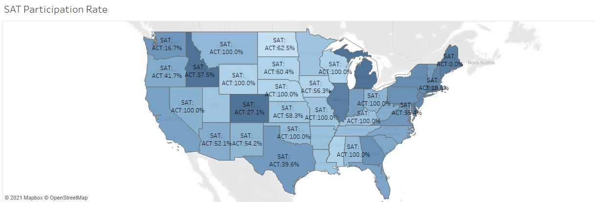
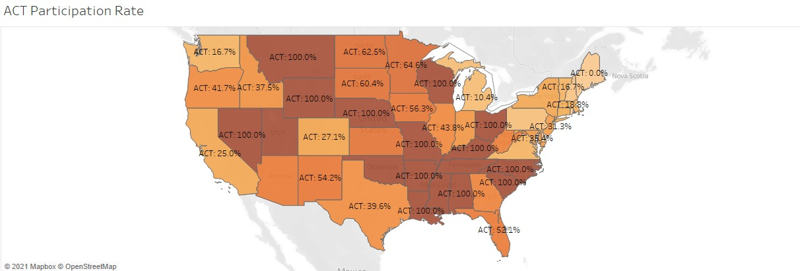

# Project 1: SAT/ ACT Participation Rate Analysis

## Executive Summary

ACT and SAT are the two most popular university admission tests in the United States. While they share a lot of similarities in terms of subjects being tested and cost of taking the test, the participation rates in each state for both tests vary significantly.

As an effort to curb growing popularity of ACT test in recent years, the College Board made some major changes in the SAT to keep it more relevant to the school curricula. To understand the impact of these changes made in 2016, we will look at the participation rate of SAT and ACT test in 2017 and 2018. Insight obtained from the analysis will be used to propose strategic recommendations to increase SAT participation rates moving forward.

**Problem Statement:** to provide recommendation for College Board Management to increase participation rates of SAT test

## Summary

It is observed that ACT is a more popular test than is SAT. However, SAT participation rates has improves year-on-year for most states while the opposite is true for ACT. This may likely mean the change in SAT format in 2016 has successfully entice more students to take the test.

On another note, **states regulations still plays a significant role** in determining participation rates of the tests. Colorado and Illinois for example, experienced a drastic increase in SAT participation rate in 2018 as state-administered SAT test is rolled out.

Interesting to note, however, for **state which administered both tests**, participation rates in **ACT is significantly higher** such as in Ohio and Tennessee. This phenomenon may be explained by the admission criteria of popular university in the state which favours one test over the other. Take University of Ohio, for example, which allows student to submit only the highest ACT score they obtained from multiple tests while they need to send all SAT scores they have ever taken.

Based on the high **negative correlation between participation rate of both tests**, it can be deduced that students tends to focus on **one test over the other** based on popularity within the states.

On another note, **participation rate is also negatively correlated to the test score**. This phenomenon may be attributed to
**selection bias** within the state as data may only reflect students from higher socio-economic class or more academically inclined which may afford to prepare and take test less popular in their state.

Finally, **socio-economic landscape of the state**, being viewed from GDP per capita point of view has some correlation to the test participation rate. States in **bottom 50% of GDP per capita** with **no SAT/ ACT requirements** tends to prefer **ACT test**.

It is also noted that **geographical area** of the state matters in terms of test preference as coastal area tends to have a higher SAT participation rate while landlocked states usually prefers ACT tests.

 
 

## Conclusion and Recommendation

As **state regulation** and **GDP per capita** plays a significant role in **participation rate**, it is recommended to invest resources in the state with currently **no state regulation and low GDP per capita**. For example, **New Mexico** currently has no state requirement on SAT/ ACT test (SAT participation rate in 2018: 18%), low GDP (within bottom 50% in US) and high degree of inequality (gini coefficient). This makes New Mexico a suitable state to focus College Board resources on as students in the states are likely to be **cost sensitive** and will be willing to make a switch if the state agree to bear the cost.

However, a handshake with the official will not suffice. For 2021 admission year, many universities have waived the requirement to take SAT or ACT as a standard of admission due to the extra difficulty for students to prepare and sit on the test. Therefore, College Board needs to redefine standardised test to not only act as a fair hurdle for everyone to participate in tertiary education, but also to prepare them for the university. Finally, SAT delivery format needs to be readjusted to be more accessible for students especially during the time of pandemic.

## Data Dictionary

|Feature|Type|Dataset|Description|
|---|---|---|---|
|state|object|final|The state where the data is from|
|participation_sat_2017|float|final|Participation rate within the state (given in decimal ranging between 0-1)  < 0 corresponds to no participation and 1 corresponds to total participation >|
|read/write_sat_2017|int|final|Average Reading and Writing subject score between 200-800 (given as integers)   < higher value corresponds to better result >|
|math_sat_2017|int|final|Average Math subject score between 200-800 (given as integers)   < higher value corresponds to better result >||
|total_sat_2017|int|final|Total score between 400-1600 (given as integers)   < higher value corresponds to better result >||
|state|object|final|The state where the data is from|
|participation_act_2017|float|final|Participation rate within the state (given in decimal ranging between 0-1)  < 0 corresponds to no participation and 1 corresponds to total participation >|
|english_act_2017|float|final|Average English subject score between 1-36 (given as decimals)   < higher value corresponds to better result >|
|math_act_2017|float|final|Average Math subject score between 1-36 (given as decimals)   < higher value corresponds to better result >|
|reading_act_2017|float|final|Average Reading subject score between 1-36 (given as decimals)   < higher value corresponds to better result >|
|science_act_2017|float|final|Average Science subject score between 1-36 (given as decimals)   < higher value corresponds to better result >|
|composite_act_2017|float|final|Average score of all subjects, ranging between 1-36 (given as decimals)   < higher value corresponds to better result >|
|test_requirement|string|final|If the state administer any test:   'SAT required': for states which administer SAT   'ACT required': for states which administer ACT   'Both tests required': for states which administer both tests   'No test required': for states which does not administer any tests|
|gdp_2017|float|final|GDP per capita for the states in 2017 ($)|
|category|string|final|Category of GDP per capita divided into 4 classes:   'Top_25%' consists of 13 states   'Top_50%' consists of 12 states   'Bottom_50%' consists of 13 states   'Bottom_25%' consists of 13 states|
|change_part_sat|float|final|Absolute change of participation rate for SAT in 2017 to 2018|
|change_part_act|float|final|Absolute change of participation rate for ACT in 2017 to 2018|

## References

[SAT data in 2017 and 2018](https://blog.collegevine.com/here-are-the-average-sat-scores-by-state/) 
[ACT data in 2017](https://www.act.org/content/dam/act/unsecured/documents/cccr2017/ACT_2017-Average_Scores_by_State.pdf) 
[ACT data in 2018](https://www.act.org/content/dam/act/unsecured/documents/cccr2018/Average-Scores-by-State.pdf) 
[List of states requiring SAT/ ACT test](https://www.testive.com/state-sat-act/) 
[US States GDP in 2018](https://www.bea.gov/data/gdp/gross-domestic-product) 
